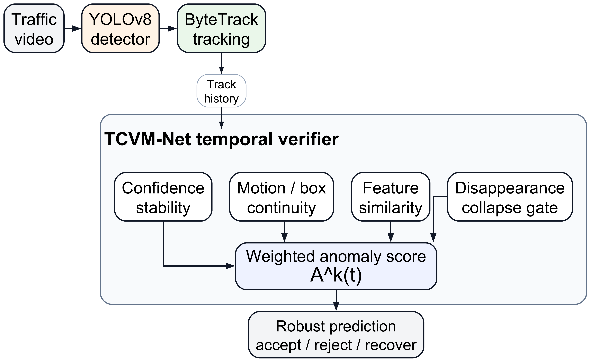
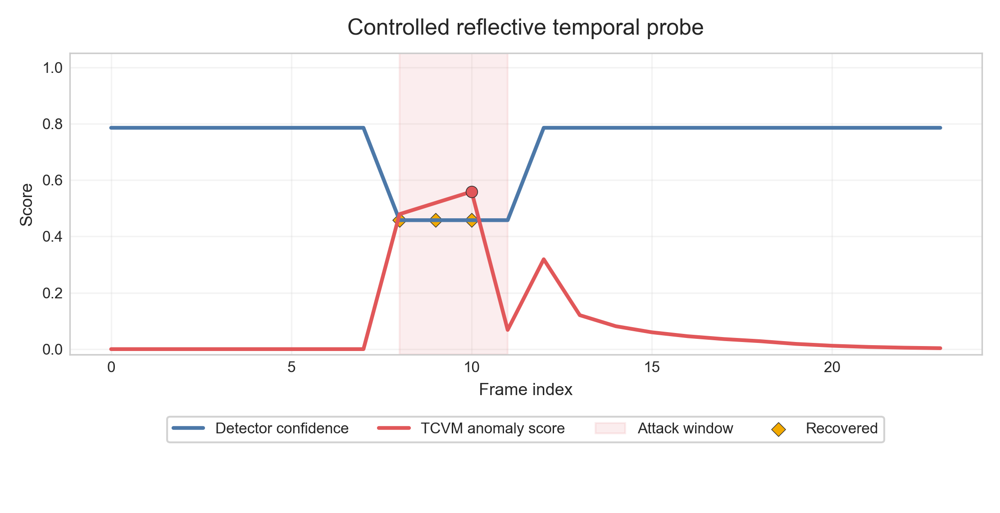
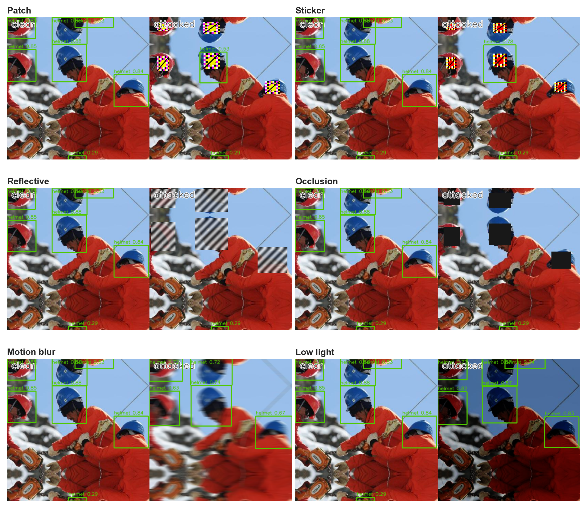
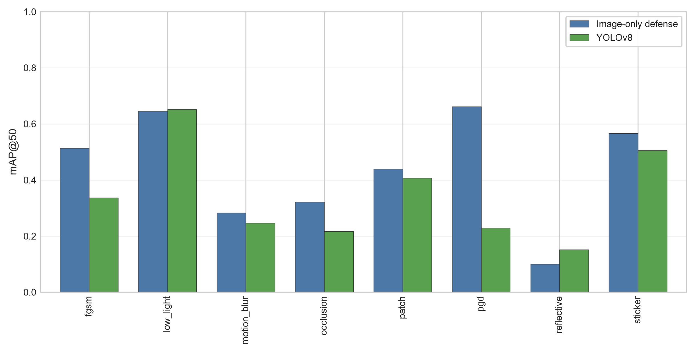
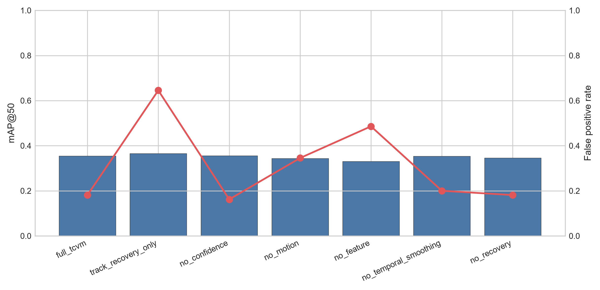

# TCVM-Net

Temporal Consistency Verification for robust traffic-surveillance object detection under physical-style adversarial attacks.

This repository contains the code, experiment configurations, tests, selected metrics, and visualization artifacts for TCVM-Net. The implementation wraps a YOLOv8 detector and ByteTrack-style association with a causal temporal verifier that combines confidence stability, motion continuity, appearance similarity, detector-count collapse, and short-gap recovery.

The manuscript and submission files are intentionally not included.

## Scope

The repository supports:

- helmet, rider, and motorcycle detection with YOLOv8;
- FGSM and PGD confidence-suppression attacks;
- patch, sticker, reflective, occlusion, motion-blur, and low-light perturbations;
- a printability-constrained detector-specific YOLOv8 patch pilot;
- image-only, tracker-only, reference-frame, adversarial-augmentation, and TCVM baselines;
- clip-disjoint threshold calibration and temporal ablations;
- mAP, ASR, anomaly detection, latency, memory, and throughput evaluation;
- publication-quality plots generated from experiment outputs.

TCVM-Net is a practical verification layer, not a certified defense. Persistent temporally smooth adaptive patches remain a known failure mode.

## Visual Overview



| Temporal anomaly response | Physical-style attack examples |
|---|---|
|  |  |

| Robustness comparison | Component ablation |
|---|---|
|  |  |

For a short demonstration sequence and speaker notes, see [`docs/presentation_walkthrough.md`](docs/presentation_walkthrough.md).

## Repository Layout

```text
configs/                  Attack, dataset, and experiment configurations
docs/                     Quick start, methodology, and reproducibility notes
outputs/figures/          Selected generated visualizations
outputs/results_50_complete/
                          Selected CSV and JSON experiment summaries
outputs/results_50_complete_v2/
                          Frozen-baseline and repeated-split summaries
scripts/attacks/          Attack generation and patch optimization
scripts/benchmark/        Robustness, TCVM, ablation, calibration, and profiling
scripts/dataset/          Dataset conversion and video-sequence preparation
scripts/train/            Clean and adversarial-augmentation training
scripts/visualization/    Plot and qualitative-figure generation
src/advtraffic/           Reusable Python package
tests/                    Unit tests for geometry and temporal verification
tools/                    Architecture rendering and explanatory-PDF utilities
```

Datasets, checkpoints, raw videos, raw detections, complete training runs, and manuscript files are excluded from version control.
The paper-table and publication-validation utilities are included, but require a local manuscript checkout when those optional commands are used.

## Installation

Python 3.10 or 3.11 is recommended.

```powershell
python -m venv .venv
.venv\Scripts\Activate.ps1
python -m pip install --upgrade pip
pip install -e .
```

Install the PyTorch build appropriate for the local CUDA version before `pip install -e .` when GPU execution is required.

Equivalent Conda metadata is provided in `environment.yml`.

## Verify the Installation

```powershell
python -m compileall src scripts
python -m pytest -q
python -m kaggle --version
```

Kaggle credentials must remain outside the repository. Follow the Kaggle CLI documentation and never commit `kaggle.json`.

## Dataset Preparation

Download the executed public sources after accepting their respective terms:

```powershell
python -m kaggle datasets download -d andrewmvd/hard-hat-detection `
  -p data/source/helmet --unzip

python -m kaggle datasets download -d a7madmostafa/bdd100k-yolo `
  -p data/source/bdd100k-yolo-kaggle --unzip

python -m kaggle datasets download -d ayushraj2349/sample-videos-for-helmet-detection-on-yolov8 `
  -p data/source/helmet_videos --unzip
```

Convert the helmet and traffic data:

```powershell
python scripts/dataset/prepare_helmet_dataset.py `
  --source-dir data/source/helmet `
  --output-dir data/helmet-yolo

python scripts/dataset/prepare_bdd100k.py `
  --source-dir data/source/bdd100k-yolo-kaggle `
  --output-dir data/bdd100k-yolo `
  --splits train val

python scripts/dataset/generate_advtraffic26.py `
  --bdd-yolo data/bdd100k-yolo `
  --helmet-yolo data/helmet-yolo `
  --output-dir data/AdvTraffic-26
```

Generate adversarial samples only after the train/validation/test split. Video experiments must use clip-disjoint calibration and test sets.

## Train YOLOv8

```powershell
python scripts/train/train_yolov8.py `
  --data data/helmet-yolo/helmet.yaml `
  --model yolov8n.pt `
  --project outputs/baseline_training `
  --name helmet_yolov8n `
  --epochs 50 `
  --imgsz 640 `
  --batch 32 `
  --device 0 `
  --seed 2026
```

The training wrapper supports CUDA, mixed precision, configurable image size, early stopping, and deterministic seeds where supported by the underlying operators.

## Generate Attacks

Attack budgets used by the executed configuration are stored in `configs/attacks/`:

- FGSM: epsilon `8/255`;
- PGD: epsilon `8/255`, step size `2/255`, 10 steps, random start;
- generic patch: 96 x 96 pixels at 0.45 target-box scale;
- sticker scale: 0.38;
- reflective intensity: 0.82 with stripe width 8;
- occlusion ratio: 0.35;
- motion-blur kernel: 17;
- low light: gamma 1.8 and gain 0.72.

Run the configured attacks:

```powershell
python scripts/attacks/run_all_attacks.py `
  --dataset-root data/helmet-yolo `
  --model outputs/baseline_training/helmet_yolov8n/weights/best.pt `
  --split test `
  --output-root outputs/attacks
```

Optimize the detector-specific patch:

```powershell
python scripts/attacks/optimize_yolov8_patch.py `
  --dataset-root outputs/tcvm_analysis/public_helmet_multiclip30_occlusion/clean `
  --model yolov8n.pt `
  --output-root outputs/attacks_detector_specific/public_helmet_yolov8_patch `
  --classes 3 `
  --device 0 `
  --conf 0.15 `
  --steps 30 `
  --max-opt-images 8 `
  --batch 8 `
  --patch-size 96 `
  --max-eval-images 120
```

The optimized patch is evaluated as a digital overlay. It is not evidence of a printed physical attack.

## Robustness Benchmark

```powershell
python scripts/benchmark/benchmark_robustness.py `
  --model outputs/baseline_training/helmet_yolov8n/weights/best.pt `
  --clean-data data/helmet-yolo/helmet.yaml `
  --attacks-root outputs/attacks `
  --split test `
  --output-dir outputs/results
```

The benchmark reports mAP@50, mAP@50:95, attack success rate, robust accuracy, and attack-wise degradation.

## Public HELMET Temporal Benchmark

Prepare 30 video-disjoint clips with three-frame annotated occlusion windows:

```powershell
python scripts/dataset/prepare_public_helmet_multiclip.py `
  --output-root outputs/tcvm_analysis/public_helmet_multiclip30_crossattack `
  --split-name test `
  --num-clips 30 `
  --frames-per-clip 24 `
  --attack-types occlusion reflective sticker patch motion_blur `
  --attack-offset 4 `
  --attack-length 3 `
  --class-id 3 `
  --occlusion-ratio 1.0
```

Run the detector and a threshold grid, then select the operating point using ten calibration clips and freeze it for twenty held-out clips:

```powershell
python scripts/benchmark/benchmark_sequence_detector.py `
  --sequence-root outputs/tcvm_analysis/public_helmet_multiclip30_crossattack/occlusion `
  --model yolov8n.pt `
  --output-dir outputs/tcvm_analysis/public_helmet_multiclip30_crossattack/occlusion/yolo_baseline `
  --classes 3 --device 0 --conf 0.15

$thresholds = 0.35, 0.40, 0.45, 0.50, 0.55, 0.60, 0.65, 0.70
foreach ($threshold in $thresholds) {
  python scripts/benchmark/benchmark_tcvm.py `
    --sequence-root outputs/tcvm_analysis/public_helmet_multiclip30_crossattack/occlusion `
    --model yolov8n.pt `
    --output-dir "outputs/tcvm_analysis/public_helmet_multiclip30_crossattack/occlusion/tcvm_calibration_grid/thr_$threshold" `
    --classes 3 --device 0 --conf 0.15 `
    --anomaly-threshold $threshold `
    --frame-labels outputs/tcvm_analysis/public_helmet_multiclip30_crossattack/occlusion/frame_labels.csv `
    --flow-scale 0.25
}

python scripts/benchmark/calibrate_tcvm_threshold.py `
  --run-root outputs/tcvm_analysis/public_helmet_multiclip30_crossattack/occlusion/tcvm_calibration_grid `
  --thresholds 0.35 0.40 0.45 0.50 0.55 0.60 0.65 0.70 `
  --calibration-clip-count 10 `
  --seed 2026 `
  --max-calibration-fpr 0.10 `
  --min-calibration-recall 0.70 `
  --output-csv outputs/results/tcvm_calibration.csv `
  --output-json outputs/results/tcvm_calibration.json
```

Repeat the clip-disjoint calibration across fixed resplits:

```powershell
python scripts/benchmark/repeat_split_sensitivity.py `
  --run-root outputs/tcvm_analysis/public_helmet_multiclip30_crossattack/occlusion/tcvm_calibration_grid `
  --thresholds 0.35 0.40 0.45 0.50 0.55 0.60 0.65 0.70 `
  --calibration-clip-count 10 `
  --seed-start 2026 `
  --num-seeds 20 `
  --max-calibration-fpr 0.10 `
  --min-calibration-recall 0.70 `
  --output-csv outputs/results_50_complete_v2/tcvm_repeated_split_sensitivity_20.csv `
  --output-json outputs/results_50_complete_v2/tcvm_repeated_split_sensitivity_20.json
```

After generating frozen TCVM, tracker-only, and reference-recovery frame logs, summarize all methods on the same held-out clip IDs:

```powershell
python scripts/benchmark/summarize_crossattack_temporal_baselines.py `
  --run-root outputs/tcvm_analysis/public_helmet_multiclip30_crossattack `
  --calibration-json outputs/results_50_complete/tcvm_calibration_protocol_public_helmet30.json `
  --tracker-root outputs/results_50_complete_v2/crossattack_tracker_recovery `
  --adav-root outputs/results_50_complete_v2/crossattack_adav_reference `
  --attack-root-override detector_patch=outputs/tcvm_analysis/public_helmet_multiclip30_detectorpatch/detector_patch `
  --output-csv outputs/results_50_complete_v2/crossattack_temporal_baselines_frozen.csv `
  --output-json outputs/results_50_complete_v2/crossattack_temporal_baselines_frozen.json `
  --output-tex outputs/results_50_complete_v2/crossattack_temporal_baselines_frozen.tex
```

See `docs/quick_start.md` for a compact end-to-end command sequence.

## Selected Executed Results

The versioned summaries under `outputs/results_50_complete/` contain the evidence behind these bounded observations:

- clean helmet YOLOv8n: 0.628 mAP@50 and 0.415 mAP@50:95;
- reflective attack: 0.152 mAP@50;
- occlusion attack: 0.216 mAP@50;
- controlled reflective probe: 0.838 to 0.944 mAP@50 with temporal recovery;
- calibrated 30-clip HELMET benchmark: 0.887 held-out anomaly F1 and 0.021 FPR;
- 20 clip-disjoint resplits: median anomaly F1 0.889 and median FPR 0.020;
- frozen occlusion comparison: TCVM-Net 0.887/0.021 F1/FPR versus reference recovery 0.870/0.012;
- frozen reflective comparison: TCVM-Net 0.887/0.021 F1/FPR versus reference recovery 0.839/0.012;
- quarter-flow 30-clip run: 14.10 FPS;
- detector-specific patch: persistent patches remain a TCVM failure mode.

These values are not claims of universal or certified robustness. The public-video occlusions and detector-specific patches are synthetic overlays on real frames.

## Visualization

```powershell
python scripts/visualization/plot_robustness.py `
  --robustness-csv outputs/results_50_complete/robustness_summary.csv `
  --output-dir outputs/figures

python scripts/visualization/plot_threshold_sensitivity.py `
  --csv outputs/results_50_complete/tcvm_threshold_sensitivity_public_helmet_multiclip20.csv `
  --output outputs/figures/tcvm_threshold_sensitivity_public_helmet_multiclip20.png
```

Selected figures are versioned for inspection; large raw image sequences are not.

## Reproducibility Rules

- Keep datasets and checkpoints outside Git history.
- Record dataset source, checksum, and license acceptance locally.
- Use fixed seeds and report nondeterministic GPU operators when encountered.
- Split videos by source clip, not by adjacent frame.
- Generate attacks after splitting.
- Calibrate temporal thresholds without test clips.
- Report clean performance, attack strength, anomaly FPR, and deployment cost together.
- Treat pseudo-label and synthetic-overlay evaluations as bounded evidence.

## License and Citation

The implementation is released under the MIT License. `CITATION.cff` contains provisional project metadata and should be updated with the final publication record after acceptance.

## Research Integrity

Selected CSV and JSON files are retained as immutable experiment summaries. Reported numbers should be changed only after rerunning the corresponding pipeline and preserving the new configuration and raw logs.
